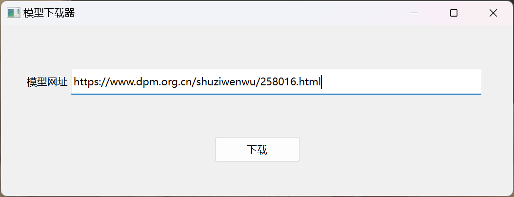

# 故宫博物院数字文物模型下载器

下载`mview`文件并转成 `glb`格式，保存到系统下载目录中。

# Download

[点此下载](https://github.com/miuchan/shuziwenwu-model-downloader/releases/download/v0.0.1/shuziwenwu-model-downloader-v0.0.1.exe)

# Requirements

Python 3.8.6 or later [[download](https://www.python.org/downloads/)]

# Usage

```bash
python .\download.py https://www.dpm.org.cn/shuziwenwu/260332.html
```

or



# Credits

[Majid Siddiqui(majimboo)](https://github.com/majimboo) - [mviewer](https://github.com/majimboo/mviewer)

# License

[MIT](LICENSE)
